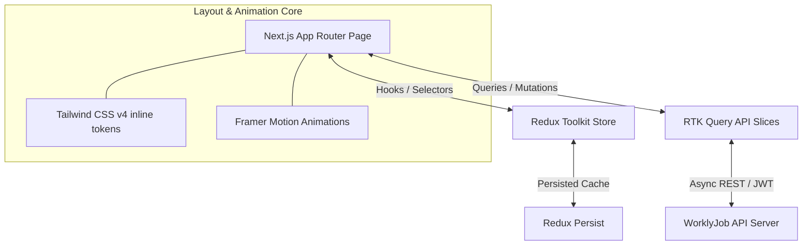

# WorklyJob Web Portal — Premium Seeker & Employer Portal

Welcome to the **WorklyJob Web Portal**—a state-of-the-art, high-fidelity recruitment web application engineered with **Next.js 16 (Turbopack)**, **TypeScript**, **Redux Toolkit & RTK Query**, **Tailwind CSS v4**, and **Framer Motion**.

The platform is designed to provide an ultra-premium, zero-flicker, and visually breathtaking user experience for both Job Seekers and Employers.

---

## 🎨 Design Philosophy & UX Highlights

1. **Clean Glassmorphic Consoles**: Integrated beautiful, high-backdrop-blur containers (`backdrop-blur-2xl`) with fine, semi-transparent border gradients to anchor premium focus points.
2. **Concentric Gyroscopic Animations**: Beautifully crafted custom vector graphics orbiting on multiple 3D axes (X, Y, Z rotations) inside animated loading portals to elevate wait times.
3. **Pixel-Perfect Zero-Flicker Skeletons**: Rather than rendering standard boilerplate skeletons that trigger layout shifts, all 9 dashboard modules immediately render static headers while conditionally mapping body skeletons. Horizontals align cleanly to standard responsive containers (`px-4 sm:px-6 lg:px-8`).
4. **Luxurious Mesh Backgrounds**: Atmospheric radial gradient ambient glows that slowly drift using hardware-accelerated animations, dynamically adjusting to Light & Dark theme parameters.

---

## 🛠️ Technology Stack



### 1. Next.js 16 (Turbopack)
- Enforces strict App Router patterns (Nested layouts, Static metadata SEO generation, dynamic router-caches).
- Pre-fetches layouts to make page transitions instantaneous.
- Optimized performance via `<Image />` priority asset loaders and zero cumulative layout shifts (CLS).

### 2. State Hydration (Redux Toolkit & RTK Query)
- **Local Cache Hydration**: RTK Query handles all remote API states. Implements tags revalidation (e.g. `['Job', 'Application', 'Profile']`) to dynamically invalidate and refresh views globally when mutations occur.
- **Persistent Sessions**: Integrates `redux-persist` with storage engines to securely hydrate JWT access states across tab reloads.

### 3. Styling Core (Tailwind CSS v4)
- Employs Tailwind v4's direct CSS `@theme` directive inside `src/app/globals.css`.
- Integrates custom brand colors (like the Chateau Green range) and responsive variables to secure absolute layout consistency.

---

## 📂 Core Client Architecture Map

The codebase is organized into high-level logical directories for maintainability:

```
src/
├── app/                  # Next.js App Router entry points, layouts, metadata & loading screens
│   ├── (auth)/           # Authentication layout and login/register pages
│   ├── (dashboard)/      # Protected Job Seeker & Employer dashboard routes
│   ├── (main)/           # Public views (Landing, Job Listings, Company Directories, legal)
│   ├── globals.css       # Tailwind CSS v4 variables, theme maps, custom components
│   └── loading.tsx       # Ultra-premium gyroscopic splash loader
├── components/           # Reusable UI & Layout components
│   ├── landing/          # Interactive homepage widgets
│   ├── shared/           # Logos (WJLogo), navigation headers, footers
│   └── ui/               # Core design elements (Dialogs, Avatars, Selects, Badges)
├── redux/                # Global store, slices, and RTK Query infrastructure
│   ├── api/              # Base RTK Query API slice with dynamic JWT header injections
│   ├── feature/          # Auth slices, active workspace managers
│   └── store.ts          # Configured Redux store with persist middlewares
├── skeleton/             # One folder per screen; mirrors view/ paths
│   ├── dashboard/
│   │   ├── employer/     # e.g. hiring-pipeline/, employees/, dashboard/
│   │   └── job-seeker/   # e.g. billing/, profile-views/, settings/
│   ├── job/              # e.g. browse/, apply/, details/, applied/
│   ├── saved-jobs/
│   └── saved-profiles/
└── view/                 # One folder per screen; page bodies for layouts
    ├── dashboard/
    │   ├── employer/       # Feature folders: analytics/, post-job/, billing/, …
    │   ├── job-seeker/
    │   └── admin/          # jobs/, users/, settings/, legal/, …
    ├── job/
    ├── landing/
    └── …                   # auth/, company/, legal/, message/, etc.
```

---

## ⚡ Core Protected Feature Portals

### 1. Candidate Overview & Analytics
- Implements responsive dashboard grid elements matching standard horizontal limits.
- Renders profile analytic tracking graphs representing clicks, follows, and active application review histories.

### 2. Live Interactive Chat
- Multi-participant live messaging integrated with backend Socket.IO instances.
- Visual typing indicators, attachment image previews, and online state pings.

### 3. Plan Checkout & Upgrades
- Visually striking subscription tier matrices comparing premium features.
- Seamless redirection pipelines to SSLCommerz checkout forms.

### 4. Interactive CV & Portfolio Builder
- Seeker profile manager allowing drag-and-drop file inputs, education/experience grids, and live PDF resume attachment streaming.

---

## 🛠️ Environment Configuration

Create a `.env.local` file at the root of `Web/Workly_client/`:

```env
# Core API URL Endpoint
NEXT_PUBLIC_API_URL="http://localhost:5000/api/v1"

# Client Host Configuration
NEXT_PUBLIC_CLIENT_URL="http://localhost:3000"

# Optional CDN Asset Prefix
NEXT_PUBLIC_CDN_URL="https://res.cloudinary.com/workly"
```

---

## 🚀 Getting Started

1. **Install workspace dependencies**:
   ```bash
   yarn install
   ```

2. **Run TypeScript verification**:
   ```bash
   yarn type-check
   ```

3. **Spin up local Turbopack development client**:
   ```bash
   yarn dev
   ```
   * *Launches server instantly on `http://localhost:3000` using Next.js Turbopack.*

4. **Verify production bundle locally**:
   ```bash
   yarn build
   yarn start
   ```
