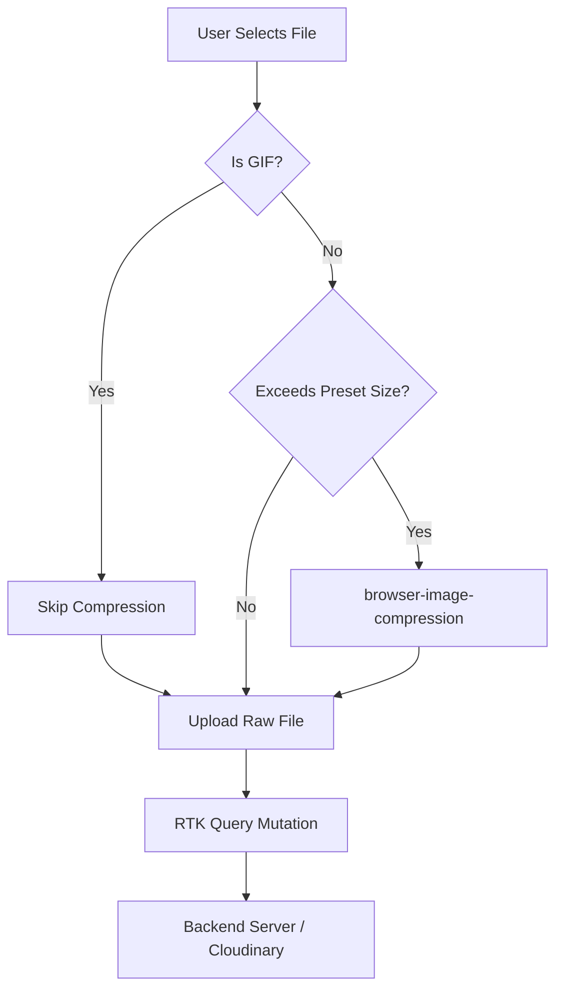

# File Upload & Image Optimization System (Frontend)

This document describes the client-side architecture, image compression presets, and the reusable uploading hook used in Workly to optimize and upload user images.

---

## 1. Architecture Overview

To ensure high performance and minimize bandwidth consumption, Workly compresses images directly in the user's browser prior to uploading them to the server. This prevents large raw images (e.g., 5MB+ photos taken on mobile cameras) from clogging the upload stream and guarantees that files fit within server-side limits.



---

## 2. Image Compression Presets

Compression behaviors are governed by presets defined in `src/utils/imageCompressor.ts`. They match the respective Cloudinary endpoints to optimize processing times and visual quality:

| Kind | Target size | Max Dimensions | Quality | Note |
|---|---|---|---|---|
| `avatar` | **1MB** | 1024px | 80% | Highly compressed, optimized for small circular profile crops. |
| `logo` | **2MB** | 1024px | 85% | Moderately compressed, transparency preserved for PNGs. |
| `cover` | **2MB** | 1920px | 90% | Lightly compressed to preserve hero banner details. |

### Special Exclusions
* **Animated GIFs**: Gif files bypass compression (`image/gif`) because canvas-based compression flattens them into a static image. They are uploaded as-is.
* **Pre-Optimized Images**: If the selected file is already below the target size (e.g., a 200KB JPEG avatar), compression is skipped to conserve user CPU power.

---

## 3. Reusable Uploading Hook (`useCompressedUpload`)

The upload lifecycle is encapsulated within `src/hooks/useCompressedUpload.ts`. 

```typescript
const { upload, isProcessing } = useCompressedUpload(kind);
```

### Flow & UX Benefits:
1. **Triggers Loader**: Sets `isProcessing` to true and displays a loader toast ("Optimizing image...").
2. **Compresses Image**: Runs `compressImage(file, kind)` in a client-side Web Worker (preventing UI thread freezes).
3. **Appends to Form**: Packs the optimized blob into a `FormData` object with the appropriate field name (`file`).
4. **Executes Mutation**: Invokes the RTK mutation trigger function passed by the component.
5. **Dismisses & Alerts**: Swaps the loader toast for a success checkmark toast (or error message) and returns the result.

---

## 4. Usage Patterns

### A. Avatar / Profile Uploads (e.g., `CompanyPersonalInformationView.tsx`)
```typescript
import { useUploadAvatarMutation } from "@/redux/feature/upload/uploadApi";
import { useCompressedUpload } from "@/hooks/useCompressedUpload";

// inside component:
const [uploadFile] = useUploadAvatarMutation();
const { upload: uploadCompressedImage, isProcessing: isUploadingImage } =
  useCompressedUpload("avatar");

const handleImageChange = async (e: React.ChangeEvent<HTMLInputElement>) => {
  const file = e.target.files?.[0];
  if (!file) return;

  try {
    const res = await uploadCompressedImage(
      file,
      (formData) => uploadFile(formData).unwrap(),
      "Profile picture updated"
    );
    if (res.success && res.data?.url) {
      // save avatar URL to user profile...
    }
  } catch (err) {
    console.error("Failed to upload image:", err);
  }
};
```

### B. Logo / Cover Banners (e.g., `CompanyProfileMediaTabs.tsx`)
Multiple hooks can be defined in a single file to handle different configurations cleanly:
```typescript
const [uploadLogo] = useUploadLogoMutation();
const [uploadCover] = useUploadCoverMutation();

const { upload: uploadLogoCompressed, isProcessing: isUploadingLogo } = useCompressedUpload("logo");
const { upload: uploadCoverCompressed, isProcessing: isUploadingCover } = useCompressedUpload("cover");

const isUploading = isUploadingLogo || isUploadingCover;
```

### C. Chatbox Attachments & Resumes (Uncompressed / Raw Uploads)

Documents, video resumes, and file attachments shared in the chatbox must not be resized or compressed to protect original data (e.g. PDFs, Word documents, raw images, or video clips). These bypass the compression hook and utilize the standard mutation directly:

```typescript
import { useUploadSingleFileMutation } from "@/redux/feature/upload/uploadApi";

// Inside chat inputs, resume uploaders, or document managers:
const [uploadSingleFile, { isLoading }] = useUploadSingleFileMutation();

const handleRawUpload = async (file: File) => {
  const formData = new FormData();
  formData.append("file", file); // Appends the raw, original file

  try {
    const res = await uploadSingleFile(formData).unwrap();
    if (res.success && res.data?.url) {
      // send message with attachment link, or save resume URL...
    }
  } catch (error) {
    console.error("Upload failed:", error);
  }
};
```
